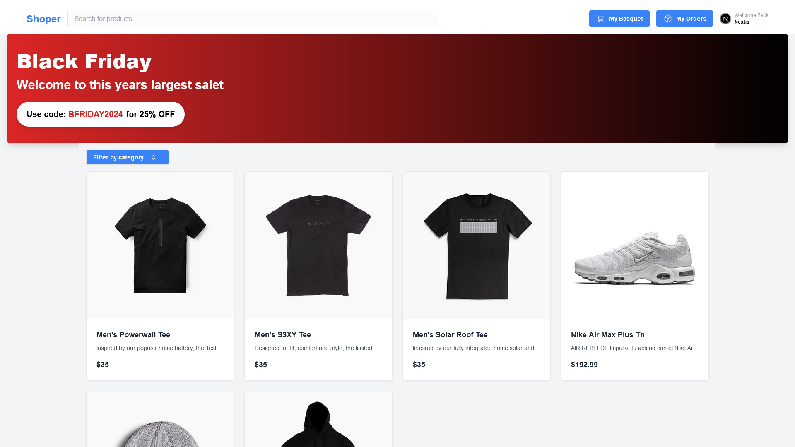

# Full-Stack E-Commerce Platform

A modern, high-performance e-commerce platform built with Next.js 15, Sanity CMS, and TypeScript. This project delivers a seamless shopping experience with server-side rendering, dynamic routing, and a headless CMS architecture.



## ✨ Features

- **Modern Tech Stack**: Built with Next.js 15, TypeScript, and Tailwind CSS
- **Headless CMS**: Powered by Sanity.io for flexible content management
- **Authentication**: Secure user authentication with Clerk
- **Dynamic Routing**: SEO-friendly URLs for products and categories
- **Responsive Design**: Mobile-first approach with modern UI components
- **Performance Optimized**: Server-side rendering and image optimization
- **Type-Safe**: Full TypeScript support with generated Sanity types
- **UI Components**: Custom components built with Radix UI and Tailwind
- **Cart Management**: Client-side shopping cart with persistent storage
- **Category Navigation**: Dynamic category filtering and navigation
- **Search Functionality**: Product search with instant results
- **Animations**: Smooth transitions using Framer Motion

## 🚀 Tech Stack

### Frontend
- Next.js 15 (App Router)
- TypeScript
- Tailwind CSS
- Framer Motion
- Radix UI Components
- Shadcn UI

### Backend & CMS
- Sanity.io
- Next.js API Routes
- Server Components
- Server Actions

### Authentication & Security
- Clerk Authentication
- Middleware Protection
- Environment Variables

### Development Tools
- ESLint
- Turbopack
- Bun Package Manager
- PostCSS
- TypeScript Configuration

## 🛠️ Installation

1. **Clone the repository**:
   ```bash
   git clone [your-repository-url]
   cd Full-Stack-E-Commerce
   ```

2. **Install dependencies**:
   ```bash
   bun install
   ```

3. **Environment Setup**:
   - Copy `.env.example` to `.env.local`
   - Fill in the required environment variables:
     - Sanity configuration
     - Clerk authentication keys
     - API endpoints

4. **Start the development server**:
   ```bash
   bun run dev
   ```

5. **Start Sanity Studio**:
   ```bash
   bun run sanity:dev
   ```

## ⚙️ Configuration

### Environment Variables
Required variables in `.env.local`:
```env
NEXT_PUBLIC_SANITY_PROJECT_ID=
NEXT_PUBLIC_SANITY_DATASET=
NEXT_PUBLIC_SANITY_API_VERSION=
NEXT_PUBLIC_CLERK_PUBLISHABLE_KEY=
CLERK_SECRET_KEY=
SANITY_STUDIO_PROJECT_ID=
SANITY_STUDIO_DATASET=

```

### Type Generation
Update Sanity schema types:
```bash
bun run typegen
```

## 📁 Project Structure

```
├── app/                    # Next.js application routes
│   ├── (auth)/            # Authentication routes
│   ├── (store)/           # Store routes (products, categories)
│   └── api/               # API routes
├── components/            
│   ├── ui/                # Reusable UI components
│   └── store/             # Store-specific components
├── lib/                   # Utility functions and configs
├── public/                # Static assets
├── sanity/               
│   ├── schemas/           # Content schemas
│   └── lib/               # Sanity utilities
└── styles/                # Global styles
```

## 🔄 Development Workflow

1. Create feature branch from `main`
2. Make changes and test locally
3. Run `bun run typegen` if updating Sanity schemas
4. Use `bun run dev` with Turbopack
5. Commit using conventional commit messages
6. Create pull request to `main`

## 🤝 Contributing

1. Fork the repository
2. Create your feature branch
3. Commit your changes
4. Push to the branch
5. Open a pull request

## 📝 License

This project is licensed under the MIT License - see the [LICENSE](LICENSE) file for details.

## 🙏 Acknowledgments

- Next.js team for the amazing framework
- Sanity.io for the powerful CMS
- Shadcn for the beautiful UI components
- Vercel for hosting and deployment solutions
